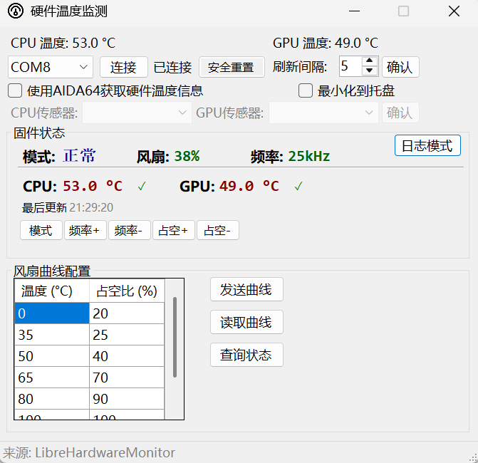

# Hardware Monitor — 硬件温度监控与智能风扇控制器

[](https://www.gnu.org/licenses/gpl-3.0)
[](https://dotnet.microsoft.com/)
[](https://www.espressif.com/)
[](https://platformio.org/)

基于 B 站 [垃圾研究社](https://space.bilibili.com/376404862) 开源的 [DIY 压风式散热器](https://www.bilibili.com/video/BV1Lr421M7u2) 方案重构的**跨端硬件温度监控系统**。

PC 端（C# WinForms）实时采集 CPU / GPU 温度，通过蓝牙 SPP 发送至 ESP32 微控制器；ESP32 运行 7 个 FreeRTOS 任务，执行 Catmull-Rom 样条插值 + Gamma 校正的温度-占空比映射，输出 25kHz PWM 信号控制风扇。



---

## 目录

- [核心功能](#核心功能)
- [系统架构](#系统架构)
- [项目目录结构](#项目目录结构)
- [技术栈与依赖](#技术栈与依赖)
- [通信协议](#通信协议)
- [本地开发环境搭建](#本地开发环境搭建)
- [部署指南](#部署指南)
- [安全机制](#安全机制)
- [运行模式与风扇曲线](#运行模式与风扇曲线)
- [测试](#测试)
- [代码审查与修复路线图](#代码审查与修复路线图)
- [贡献规范](#贡献规范)
- [许可证](#许可证)
- [致谢](#致谢)

---

## 核心功能

### PC 端（WinForms）

| 功能 | 说明 |
|------|------|
| 温度采集 | 双数据源 — LibreHardwareMonitor（自动检测）或 AIDA64 注册表共享 |
| 蓝牙通信 | SPP 虚拟串口，支持自动连接和重连 |
| 仪表盘 | 实时显示 ESP32 遥测：运行模式、风扇占空比、PWM 频率、CPU/GPU 温度 |
| 远程控制 | 模式切换（静音/正常/Turbo/手动）、频率 ±200Hz、占空比 ±10% |
| 风扇曲线 | 在线上传/读取曲线（2-10 点），支持编辑后一键发送 |
| 安全重置 | 远程清除 ESP32 安全锁定，恢复正常风扇控制 |
| 配置持久化 | 串口名、刷新间隔、AIDA64 传感器选择、风扇曲线均自动保存 |
| 系统托盘 | 最小化到托盘后台运行，右键菜单显隐窗口 |

### ESP32 固件端（FreeRTOS）

| 功能 | 说明 |
|------|------|
| 蓝牙接收 | 轮询蓝牙 SPP 缓冲区，提取 `$TYPE,PAYLOAD*XX` 帧并校验 |
| Catmull-Rom 插值 | C1 连续的样条曲线将温度映射到目标占空比 |
| Gamma 校正 | 三种模式的幂函数曲线（γ=1.6 / 1.2 / 0.85） |
| PWM 输出 | 25kHz、8-bit 分辨率，每 50ms 斜坡逼近目标值（±3 步/周期） |
| OLED 显示 | SSD1306 128×64 四象限：模式、占空比、频率、CPU/GPU 温度 |
| 物理按钮 | 5 个按钮独立消抖（60ms），支持模式/频率/占空比调节 |
| 三层安全 | 任务看门狗（5s）+ 心跳监控（3s）+ 温度超时（5s） |
| 蓝牙 PIN 认证 | 配对前需输入 PIN 码，防止未授权连接 |

---

## 系统架构

```
┌──────────────────────────────────┐        蓝牙 SPP                ┌─────────────────────────────────┐
│  PC (C# WinForms .NET 4.8)       │ ◄──── $TYPE,PAYLOAD*XX ────► │  ESP32 (FreeRTOS v3.0)          │
│                                  │       XOR 校验和               │                                 │
│  ┌────────────────────────────┐  │                                │  ┌───────────────────────────┐  │
│  │ Hardware/                  │  │                                │  │ FreeRTOS Tasks (7)         │  │
│  │  IHardwareMonitor          │  │                                │  │  bt_rx    (10ms, prio 3)   │  │
│  │  ├─ LibreHWMonitorService  │  │                                │  │  bt_tx    (50ms, prio 2)   │  │
│  │  └─ Aida64MonitorService   │  │                                │  │  control  (100ms, prio 3)  │  │
│  ├────────────────────────────┤  │                                │  │  pwm      (50ms, prio 2)   │  │
│  │ Communication/             │  │                                │  │  ui       (100ms, prio 1)  │  │
│  │  Protocol (编码/解码)       │  │                                │  │  button   (20ms, prio 3)   │  │
│  │  SerialPortService         │  │                                │  │  safety   (1s, prio 2)     │  │
│  ├────────────────────────────┤  │                                │  ├───────────────────────────┤  │
│  │ Configuration/             │  │                                │  │ Peripherals                │  │
│  │  AppConfigService          │  │                                │  │  PWM Fan (25kHz, 8-bit)    │  │
│  └────────────────────────────┘  │                                │  │  SSD1306 OLED (128×64)     │  │
│                                  │                                │  │  5× Physical Buttons       │  │
│  ┌────────────────────────────┐  │                                │  └───────────────────────────┘  │
│  │ MainForm (UI)              │  │                                │                                 │
│  │  Dashboard + Log View      │  │                                │  ┌───────────────────────────┐  │
│  │  Remote Control Panel      │  │                                │  │ Safety Layers              │  │
│  │  Fan Curve Editor          │  │                                │  │  Task WDT (5s panic)       │  │
│  │  System Tray + Config      │  │                                │  │  Heartbeat Monitor (3s)    │  │
│  └────────────────────────────┘  │                                │  │  Data Timeout (5s)         │  │
└──────────────────────────────────┘                                │  └───────────────────────────┘  │
                                                                    └─────────────────────────────────┘
```

---

## 项目目录结构

```
Hardware-Monitor-refactor/
│
├── CPUwenduhuoqu/                       # PC 端 C# WinForms 项目 (.NET 4.8)
│   ├── MainForm.cs                      #   主窗体业务逻辑（生命周期、定时器、远程控制）
│   ├── MainForm.Designer.cs             #   VS 设计器管理的控件布局
│   ├── Program.cs                       #   程序入口
│   ├── App.config                       #   应用配置文件
│   ├── Hardware/
│   │   ├── IHardwareMonitor.cs          #   硬件监控接口
│   │   ├── LibreHardwareMonitorService.cs # LibreHardwareMonitor 实现
│   │   └── Aida64MonitorService.cs      #   AIDA64 注册表实现
│   ├── Communication/
│   │   ├── Protocol.cs                  #   协议帧编码/解码/校验和 + 类型识别
│   │   ├── SerialPortService.cs         #   线程安全串口封装
│   │   └── FanCurvePoint.cs             #   风扇曲线数据模型
│   └── Configuration/
│       └── AppConfigService.cs          #   类型化配置读写（脏标记延迟写入）
│
├── CPUwenduhuoqu.Tests/                 # C# 单元测试项目 (xUnit, net48)
│   ├── ProtocolChecksumTests.cs         #   XOR 校验和正确性 + 边界条件
│   ├── ProtocolFrameTests.cs            #   帧类型识别 + 错误帧拒绝
│   ├── ProtocolBuildTests.cs            #   帧构建 + 参数边界验证
│   └── ProtocolParseTests.cs            #   响应解析 + NACK 错误码
│
├── firmware/                            # ESP32 固件 (Arduino / PlatformIO)
│   ├── firmware.ino                     #   主入口（引脚定义、任务创建、setup/loop）
│   ├── config.h                         #   全局常量（GPIO、阈值、任务栈、协议参数）
│   ├── protocol.h / protocol.cpp        #   帧编解码、校验和、命令路由
│   ├── system_state.h / system_state.cpp # 全局共享状态 + FreeRTOS Mutex API
│   ├── fan_curve.h / fan_curve.cpp      #   Catmull-Rom 样条插值 + Gamma 校正
│   ├── safety.h / safety.cpp            #   任务看门狗 + 心跳监控 + 故障全速
│   ├── task_bt_rx.h / task_bt_rx.cpp    #   蓝牙接收（帧提取、ACL/NACK 路由）
│   ├── task_bt_tx.h / task_bt_tx.cpp    #   蓝牙发送（队列消费 + 周期性遥测）
│   ├── task_control.h / task_control.cpp #  温度 → 占空比控制算法
│   ├── task_pwm.h / task_pwm.cpp        #   PWM 输出（斜坡逼近 + safety_override）
│   ├── task_ui.h / task_ui.cpp          #   OLED 显示（四象限 + 脏标记优化）
│   ├── task_button.h / task_button.cpp  #   按钮输入（5 按钮 + 60ms 消抖）
│   └── test/native/                     #   桌面端原生 C++ 测试
│       ├── arduino_stub.h               #     Arduino API 桩
│       ├── freertos_stub.h              #     FreeRTOS 桩
│       ├── test_protocol.cpp            #     协议解析/构建/边界值测试
│       └── test_fan_curve.cpp           #     曲线校验/插值/安全回退测试
│
├── tests/shared/                        # 跨端共享测试资源
│   └── protocol_vectors.json            #   15 组协议一致性测试向量
│
├── packages/                            # NuGet 包（LibreHardwareMonitorLib, HidSharp）
├── .gstack/repair-phases/               # 结构化修复计划文档
│   ├── 00-index.md                      #   总索引与修复路线图
│   ├── phase1-emergency-fix.md          #   P0 紧急修复（6 项）
│   ├── phase2-test-infrastructure.md    #   测试基础设施建设
│   ├── phase3-high-priority.md          #   P1 高优先级修复（12 项）
│   ├── phase4-medium-priority.md        #   P2 中优先级修复（10 项）
│   └── phase5-continuous-improvement.md #   P3 持续优化（16 项）
│
├── CPU_Temperture_Monitor.sln           # Visual Studio 解决方案
├── CODE_REVIEW_REPORT.md                # 全面代码审查报告
├── LICENSE                              # GPL v3
└── README.md                            # 本文件
```

---

## 技术栈与依赖

### PC 端

| 组件 | 版本 | 用途 |
|------|------|------|
| .NET Framework | 4.8 | 运行时框架 |
| C# / WinForms | — | UI 框架 |
| [LibreHardwareMonitorLib](https://github.com/LibreHardwareMonitor/LibreHardwareMonitor) | 0.9.3 | 默认温度采集引擎 |
| [HidSharp](https://github.com/IntergatedCircuits/HidSharp) | 2.1.0 | LibreHardwareMonitor 依赖 |
| AIDA64 Extreme | ≥6.00 | 可选温度源（通过注册表共享内存） |
| xUnit | 2.6.6 | PC 端单元测试框架 |

### ESP32 固件端

| 组件 | 版本 | 用途 |
|------|------|------|
| ESP32 Arduino Core | 2.0.4+ | 开发框架 |
| FreeRTOS | 内置 | 实时操作系统 |
| [Adafruit SSD1306](https://github.com/adafruit/Adafruit_SSD1306) | ≥2.5.7 | OLED 显示驱动 |
| [Adafruit GFX Library](https://github.com/adafruit/Adafruit_GFX_Library) | ≥1.11.9 | 图形基库 |
| BluetoothSerial | 内置 | 蓝牙 SPP 通信 |

### 开发工具

| 工具 | 用途 |
|------|------|
| Visual Studio 2022 | PC 端开发与设计器 |
| Arduino IDE 或 PlatformIO | ESP32 固件编译与烧录 |
| Git | 版本控制 |

---

## 通信协议

所有帧采用 **`$TYPE,PAYLOAD*XX\n`** 格式：
- `$` — 帧起始标记
- `TYPE` — 3 字符命令类型
- `,` — 字段分隔符
- `PAYLOAD` — 可变长度数据
- `*XX` — 两字节十六进制大写 XOR 校验和（对 `TYPE,PAYLOAD` 部分逐字节异或）
- `\n` — 帧结束符

### PC → ESP32（下行命令）

| 帧类型 | 格式 | 示例 | 说明 |
|--------|------|------|------|
| `CPU` | `$CPU,<temp>*XX\n` | `$CPU,45.5*28\n` | CPU 温度上报（°C，-50 ~ 150） |
| `GPU` | `$GPU,<temp>*XX\n` | `$GPU,72.1*3A\n` | GPU 温度上报（°C，-50 ~ 150） |
| `STA` | `$STA,?*XX\n` | `$STA,?*5C\n` | 查询 ESP32 当前状态 |
| `FCV` | `$FCV,<N>,<t1>,<d1>,...,<tN>,<dN>*XX\n` | `$FCV,3,0.0,20,50.0,50,100.0,100*AB\n` | 上传风扇曲线（N ∈ [2, 10]） |
| `FCQ` | `$FCQ,?*XX\n` | `$FCQ,?*5D\n` | 查询当前风扇曲线 |
| `MOD` | `$MOD,<1-4>*XX\n` | `$MOD,2*1F\n` | 远程切换模式 |
| `FRQ` | `$FRQ,<hz>*XX\n` | `$FRQ,25000*6E\n` | 远程设置 PWM 频率（1000 ~ 40000 Hz） |
| `DUT` | `$DUT,<20-100>*XX\n` | `$DUT,50*3C\n` | 远程设置目标占空比（最低安全值 20%） |
| `SAF` | `$SAF*XX\n` | `$SAF*1A\n` | 远程清除安全锁定 |

### ESP32 → PC（上行响应）

| 帧类型 | 格式 | 说明 |
|--------|------|------|
| `STP` | `$STP,<mode>,<duty%>,<freqHz>,<cpuTemp>,<gpuTemp>,<cpuValid>,<gpuValid>*XX\n` | 状态遥测（每 2 秒自动发送） |
| `FCP` | `$FCP,<N>,<t1>,<d1>,...,<tN>,<dN>*XX\n` | 当前风扇曲线响应 |
| `ACK` | `$ACK*XX\n` | 操作成功确认 |
| `NAK` | `$NAK,<CC>*XX\n` | 错误响应（01=帧错误 02=队列满 03=曲线无效） |

### 协议约束

| 规则 | 说明 |
|------|------|
| 最低安全占空比 | 20%（低于此值的 DUTY_SET / FCURVE_SET 帧将被拒绝） |
| 风扇曲线点数 | 2 ~ 10 个点 |
| 曲线首点温度 | 必须 ≈ 0°C（容差 ±0.01） |
| 温度单调性 | 曲线点温度必须严格递增 |
| 占空比单调性 | 曲线点占空比必须非递减 |
| 温度有效范围 | -50°C ~ 150°C（超范围帧被拒绝） |
| 帧速率限制 | 每秒最多 10 帧（超限帧静默丢弃） |
| 蓝牙配对 | 需输入 PIN 码（默认 `1234`） |

---

## 本地开发环境搭建

### 前置条件

- **Windows 10/11**（x64）
- **Visual Studio 2022**（Community / Professional / Enterprise）
  - 工作负载：`.NET 桌面开发`
- **Arduino IDE**（≥ 2.0）或 **PlatformIO**（VS Code 插件）
- **ESP32 开发板** + Micro-USB 数据线
- **Git**

### PC 端开发

```bash
# 1. 克隆仓库
git clone https://github.com/Payton9000/Hardware-Monitor.git
cd Hardware-Monitor

# 2. 切换到开发分支
git checkout main

# 3. 使用 Visual Studio 2022 打开解决方案
start CPU_Temperture_Monitor.sln
```

在 VS 中：
1. 右键解决方案 → **还原 NuGet 包**
2. 确保目标框架为 `.NET Framework 4.8`
3. 按 `F5` 编译并运行

> **注意**：如果仅需编译测试项目（`CPUwenduhuoqu.Tests`），需确保安装了 xUnit 运行器。在 VS 中打开 **测试资源管理器** 即可发现测试。

### ESP32 固件开发

**方式一：Arduino IDE**

```bash
# 1. 安装 ESP32 开发板支持
#    文件 → 首选项 → 附加开发板管理器网址：
#    https://raw.githubusercontent.com/espressif/arduino-esp32/gh-pages/package_esp32_index.json

# 2. 工具 → 开发板 → 开发板管理器 → 搜索安装 "esp32" (by Espressif Systems)

# 3. 安装库依赖
#    项目 → 加载库 → 管理库 → 搜索安装：
#    - Adafruit SSD1306
#    - Adafruit GFX Library

# 4. 打开 firmware/firmware.ino，选择开发板 "ESP32 Dev Module"

# 5. 编译 & 烧录
```

**方式二：PlatformIO（推荐）**

```bash
# 在 firmware/ 目录下创建 platformio.ini
# 然后通过 VS Code PlatformIO 插件编译烧录
```

### 运行测试

```bash
# C# 单元测试（在 Visual Studio 中）
# 测试 → 运行所有测试

# ESP32 原生测试（桌面端编译）
cd firmware/test/native
# 使用 g++ 编译并运行（需要安装 MinGW 或使用 WSL）
g++ -std=c++17 -I.. -o test_runner test_protocol.cpp test_fan_curve.cpp
./test_runner
```

---

## 部署指南

### 硬件准备

| 物料 | 规格 | 数量 |
|------|------|------|
| ESP32 开发板 | ESP32-DevKitC 或兼容板 | 1 |
| SSD1306 OLED | 128×64 I2C（地址 0x3C） | 1 |
| 4 线 PWM 风扇 | 12V，支持 25kHz PWM | 1 |
| 轻触按钮 | 6×6mm | 5 |
| 面包板 + 杜邦线 | — | 若干 |

### 连接步骤

```
ESP32 GPIO  5  → PWM 风扇控制信号（需电平转换至 5V/12V）
ESP32 GPIO 12  → 按钮 0（模式切换）
ESP32 GPIO 13  → 按钮 1（频率 +200Hz）
ESP32 GPIO 14  → 按钮 2（频率 -200Hz）
ESP32 GPIO 15  → 按钮 3（占空比 +10%）
ESP32 GPIO 16  → 按钮 4（占空比 -10%）
ESP32 GPIO 21  → SSD1306 SDA
ESP32 GPIO 22  → SSD1306 SCL
ESP32 VIN/GND  → 5V 电源
```

所有按钮使用 `INPUT_PULLDOWN` 模式（按下为 HIGH）。

### 首次启动流程

1. **烧录 ESP32 固件**：通过 Arduino IDE 或 PlatformIO 将 `firmware/` 编译烧录
2. **ESP32 上电**：OLED 显示 "Fan Ctrl v3.0"，Serial Monitor 输出 `[INIT]` 日志
3. **PC 蓝牙配对**：
   - Windows 设置 → 蓝牙 → 添加设备
   - 搜索 "ESP32_FanController"
   - 输入 PIN 码 `1234` 完成配对
   - 记录生成的 COM 端口号（如 `COM8`）
4. **启动 PC 端程序**：
   - 运行 `CPUwenduhuoqu.exe`
   - COM 端口下拉选择蓝牙虚拟串口
   - 点击 **连接**
5. **验证**：仪表盘开始显示 ESP32 遥测数据，OLED 同步显示 CPU/GPU 温度

### 持续运行建议

- 勾选 **"最小化到托盘"**，程序可在后台长期运行
- 如需使用 AIDA64 作为温度源，勾选 **"使用 AIDA64 获取硬件温度信息"**，并在 AIDA64 中启用 **"外部应用程序"→"启用共享内存"**
- 刷新间隔建议设置为 5-10 秒；更短间隔（3 秒）会增加蓝牙帧速率

---

## 安全机制

ESP32 固件实现三层防护，确保风扇在异常情况下不会停止运转：

```
┌──────────────────────────────────────────────┐
│  第一层：任务看门狗 (5s)                       │
│  esp_task_wdt 监控所有核心任务，任何任务        │
│  死锁超过 5 秒 → ESP32 自动硬件复位            │
├──────────────────────────────────────────────┤
│  第二层：心跳监控 (3s)                          │
│  safety 任务每秒检查 bt_rx / control / pwm      │
│  的心跳计数器，任一心跳超时 → safety_override   │
│  → PWM 强制 100%                               │
├──────────────────────────────────────────────┤
│  第三层：温度超时 (5s)                          │
│  CPU 和 GPU 温度数据独立判定，双路均超时        │
│  → effective_temp = 100°C（最坏假定全速散热）   │
└──────────────────────────────────────────────┘
```

### safety_override 恢复机制

- **自动恢复**：心跳恢复后 30 秒，safety_override 自动清除
- **远程重置**：PC 端点击 **"安全重置"** 按钮发送 `$SAF*XX\n` 立即清除

---

## 运行模式与风扇曲线

### 运行模式

| 模式 | 编号 | Gamma γ | 效果 |
|------|------|---------|------|
| 静音 Quiet | 1 | 1.6 | 低负载极安静，占空比增长较缓 |
| 正常 Normal | 2 | 1.2 | 略偏静音，全程平滑线性加速 |
| Turbo | 3 | 0.85 | 提前提速响应，高温段精细控制 |
| 手动 Manual | 4 | — | 按钮或远程直接调节占空比（±10%，最低 20%） |

占空比通过幂函数计算：`duty = 255 × (pct / 100)^γ`（Gamma 校正）。

### 默认风扇曲线

| 温度 (°C) | 占空比 (%) |
|-----------|------------|
| 0.0 | 20 |
| 30.0 | 20 |
| 45.0 | 35 |
| 60.0 | 55 |
| 75.0 | 75 |
| 90.0 | 95 |
| 100.0 | 100 |

控制任务使用 **Catmull-Rom 样条插值**（C1 连续），在相邻控制点之间平滑过渡。

---

## 测试

### 测试覆盖总览

| 模块 | 测试框架 | 文件 | 覆盖内容 |
|------|---------|------|---------|
| Protocol (C#) | xUnit | `CPUwenduhuoqu.Tests/` | 校验和正确性、帧类型识别、帧构建边界、响应解析 |
| Protocol (C++) | 原生 assert | `firmware/test/native/test_protocol.cpp` | 校验和计算、帧解析路由、帧构建、边界值拒绝 |
| FanCurve (C++) | 原生 assert | `firmware/test/native/test_fan_curve.cpp` | 曲线设置校验、样条插值、空曲线安全值（100%） |

### 跨端协议一致性

`tests/shared/protocol_vectors.json` 定义了 15 组测试向量，C# 和 C++ 测试共用相同的输入/期望输出，确保双端协议行为完全一致。

### 已知测试缺口

| 模块 | 建议补充 |
|------|---------|
| `SerialPortService` | 连接/断开生命周期、Send 线程安全 |
| `AppConfigService` | 配置读写、默认值回退、并发安全 |
| `task_control` (C++) | 双温源 max 选取、超时退避 |
| `task_pwm` (C++) | 斜坡步进、频率变更、safety_override 互斥 |

---

## 代码审查与修复路线图

项目经历过两轮系统性审查和修复：

### 第一轮：结构化修复计划（`repair-phases/`）

| 阶段 | 状态 | 内容 |
|------|------|------|
| Phase 1 — P0 紧急修复 | ✅ 全部完成 | 死锁修复、蓝牙 PIN 认证、最低安全占空比、safety_override 恢复 |
| Phase 2 — 测试建设 | ✅ 已交付 | C# xUnit + ESP32 原生测试 + 跨端协议向量 |
| Phase 3 — P1 高优先级 | ✅ 部分完成 | 输入校验、异常处理、验证逻辑去重、注释修复 |
| Phase 4 — P2 中优先级 | ✅ 部分完成 | 注册表安全、帧速率限制、日志性能、版本号统一 |
| Phase 5 — P3 持续优化 | 🔄 进行中 | 蓝牙名泛化、调试输出控制、配置文件加密、硬件在环测试 |

### 第二轮：代码审查报告（`CODE_REVIEW_REPORT.md`）

| 等级 | 已修复 | 内容 |
|------|--------|------|
| 🔴 阻断 | 4/4 | 定时器堆积、safety_override 竞态、state_init 失败处理、I/O 风暴 |
| 🟡 建议 | 2/8 | ClosePortInternal 日志、风扇曲线校验去重 |

---

## 贡献规范

欢迎提交 Issue 和 Pull Request！

### 分支策略

```
main          ← 稳定发布分支
  └── fix/*   ← Bug 修复分支（从 main 创建）
  └── feat/*  ← 新功能分支（从 main 创建）
```

### 提交信息格式

遵循 [Conventional Commits](https://www.conventionalcommits.org/) 规范：

```
<type>(<scope>): <subject>

<body>
```

示例：
```
fix(firmware): prevent fan stall via minimum safe duty cycle

DUTY_SET lower bound changed from 0 to MIN_SAFE_DUTY_PERCENT (20).
FCURVE_SET handler now rejects curves with any point below 20%.
```

常用类型：`fix`、`feat`、`refactor`、`perf`、`test`、`docs`、`style`

### 代码风格

- **C#**：遵循 Visual Studio 默认代码风格（4 空格缩进、PascalCase 方法、camelCase 字段）
- **C++（ESP32）**：遵循 Arduino 惯例（4 空格缩进、snake_case 函数、PascalCase 类），FreeRTOS 任务函数使用 `task_<name>` 前缀
- 所有修复引用问题编号（如 `P0-3`、`CR #1`）以便追溯
- 公共 API 必须有 XML 文档注释（C#）或 Doxygen 注释（C++）

### 提交前检查清单

- [ ] 代码编译通过（PC 端 VS 生成 / ESP32 Arduino IDE 验证）
- [ ] 相关测试通过（`CPUwenduhuoqu.Tests` + `firmware/test/native`）
- [ ] 新增功能有对应的测试覆盖
- [ ] 破坏性变更在提交信息中明确标注
- [ ] 更新受影响的文档和架构图

---

## 许可证

本项目采用 **GNU General Public License v3.0** 许可证。详见 [LICENSE](LICENSE)。

```
Hardware Monitor — CPU/GPU temperature monitoring and smart fan controller
Copyright (C) 2024-2026  Payton9000 and contributors

This program is free software: you can redistribute it and/or modify
it under the terms of the GNU General Public License as published by
the Free Software Foundation, either version 3 of the License, or
(at your option) any later version.
```

---

## 致谢

- 原始项目：[垃圾研究社](https://space.bilibili.com/376404862) — B 站 UP 主，DIY 压风式散热器方案
- 上游仓库：[Payton9000/Hardware-Monitor](https://github.com/Payton9000/Hardware-Monitor)
- 依赖项目：
  - [LibreHardwareMonitor](https://github.com/LibreHardwareMonitor/LibreHardwareMonitor) — 开源硬件监控库
  - [Adafruit SSD1306](https://github.com/adafruit/Adafruit_SSD1306) — OLED 驱动库
  - [Espressif Arduino ESP32](https://github.com/espressif/arduino-esp32) — ESP32 Arduino 核心
